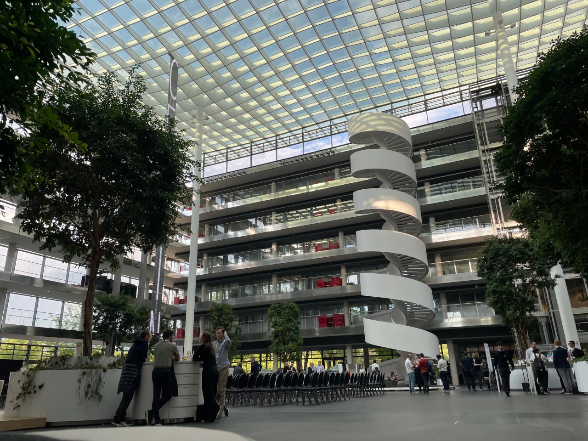

# Unsupervised Learning

This section contains my notes and practical examples for unsupervised machine learning techniques.

## What is Unsupervised Learning?

Unsupervised learning works with **unlabeled data**.

The main goal is to discover *patterns*, *structures*, or *groups* in the data.

## Main Techniques

- Clustering
- Dimensionality Reduction
- Anomaly Detection

## Simple Python Example

```python
from sklearn.cluster import KMeans

model = KMeans(n_clusters=3, random_state=42)
model.fit(X)
```
## Mathematical Equation Example

The K-means objective function is:

$$
J =
\sum_{k=1}^{K}
\sum_{x_i \in C_k}
\|x_i - \mu_k\|^2
$$

Where:

- $K$ is the number of clusters.
- $C_k$ is cluster $k$.
- $x_i$ is a data point.
- $\mu_k$ is the centroid of cluster $k$.

## Comparison Table

| Technique | Main Purpose | Example |
|---|---|---|
| K-Means | Clustering | Customer segmentation |
| PCA | Dimensionality reduction | Feature compression |
| DBSCAN | Density-based clustering | Detecting irregular clusters |

## Image Example




